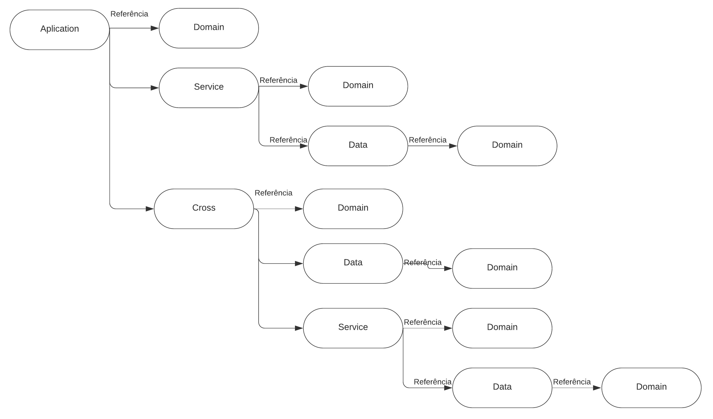

### 🛠 Tecnologias

As seguintes ferramentas foram usadas na construção do projeto:

-  [.NET Core 3.1 SDK](https://dotnet.microsoft.com/download/dotnet-core/thank-you/sdk-3.1.401-windows-x64-installer)
-  [MySql](https://www.mysql.com/)
-  [SQL Server](https://docs.microsoft.com/pt-br/sql/sql-server/?view=sql-server-ver15)
-  [AutoMapper](https://automapper.org/)
-  [Swagger](https://swagger.io/)
-  [EntityFramework Core](https://docs.microsoft.com/pt-br/ef/core/)
-  [Jwt - JSON Web Tokens](https://jwt.io/)
-  [NewtonSoft](https://www.newtonsoft.com/json)
-  [xUnit](https://xunit.net/)
-  [Faker.NETCore](https://www.nuget.org/packages/Faker.NETCore)


## Api.Application - Estrutura padrão - controllers - projeto principal de inicio da solução.
## Api.Application.Test - xUnit - biblioteca de classes para executar de teste unitário.
## Api.Data - Comunicação com o Banco de Dados - biblioteca de classes
## Api.Data.Test - xUnit - biblioteca de classes para executar de teste unitário.
## Api.Service - Regra de negocio - biblioteca de classes
## Api.Service.Test - xUnit - biblioteca de classes para executar de teste unitário.
## Api.Dominio - Modelos, Classes - biblioteca de classes
## Api.CrossCutting - Suporte para camada application - biblioteca de classes
## Api.Integration.Test - xUnit - biblioteca de classes para executar de teste de integração.

# <p align="center">Relacionamento de camadas DDD</p>




```shell
Rodrigo Luiz Madeira Furlaneti - 11 995882409 WhatsApp
```


